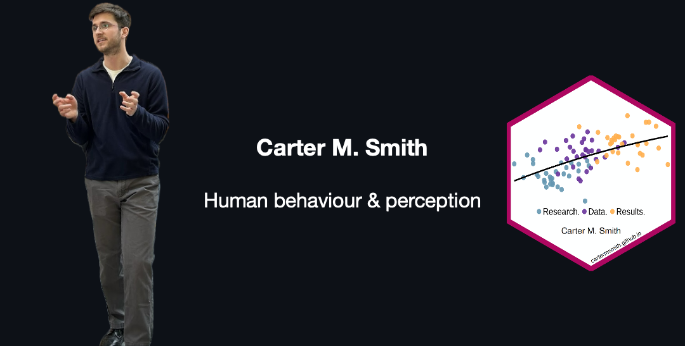

## About

Hi, I'm Carter. I research the physical and environmental signals that shape how humans decide, perceive, and feel.

Currently:

- I'm researching how the physical cues in other people’s movements shape our judgments of their intentions, and how their intentions guide our attention.

Previously:

- I explored how changing the size of virtual reality slot machines altered gambling behaviour, [showing how environmental design shapes decision-making](https://cartermsmith.github.io/research/smith-scheerer-2025-thesis/).

- I studied how auditory sensitivities like misophonia and hyperacusis [relate to poor mental health outcomes](https://cartermsmith.github.io/research/smith-et-al-2026-DST/) in post-secondary students.

Right now, I'm completing my MA in Cognitive Psychology at the University of Waterloo. 

I'm excited to transfer the skills that I've learned during my academic training to help research-focused organizations translate data they have about humans into insights about human decision-making, perception, or judgment.

I'm happy to connect on [LinkedIn](https://www.linkedin.com/in/carter-m-smith), and you are welcome to write to me [here](mailto:cartermdsmith@gmail.com).

## Languages & Tools

### Data Analysis

 

- I primarily work with Python and the R language for statistical computing. Polished versions of my data analysis projects will be published to my [personal website](https://cartermsmith.github.io) and here on GitHub soon.
- Learning Duckdb so I can work with more big data. 
- Quarto for writing and publishing my documents and analyses.

### Experimental Design

- I work with libraries inside Javascript and Python to collect data both online and in-person. 
- Qualtrics for the design and deployment of large-scale surveys and questionnaires.
- ffmpeg saves me countless hours of video editing work.

### Also in the Toolkit

- reveal.js for designing and easily sharing reproducible presentations. 
- Obsidian for markdown notes and knowledge management.
- and git for version-controlled code, notes, and [website](https://cartermsmith.github.io) content.

## Skills

Quantitative research • data analysis • R • Python • experimental design • survey design • user research • behavioural science • project management